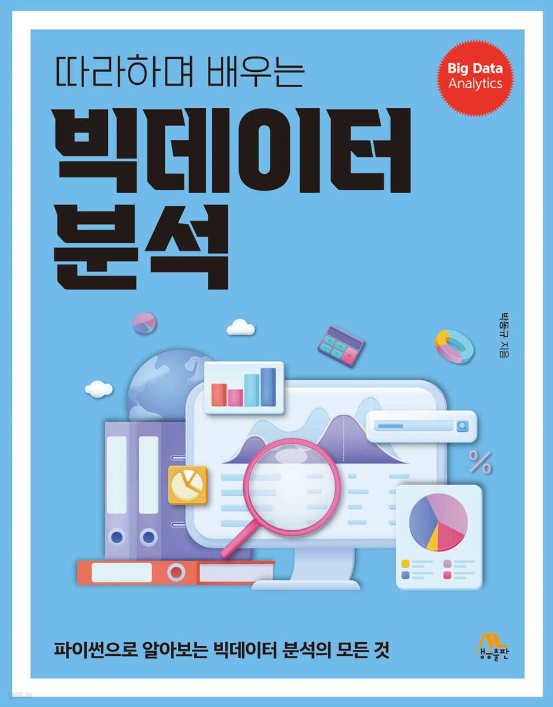

# 이 곳은 "생능 출판사"의 "따라하며 배우는 빅데이터 분석(2024년 11월 출판)" 저장소입니다.
## 프로그램 코드와 자료를 제공합니다.

안녕하세요 독자여러분 이곳은 이 책의 소스 코드와 관련 파일, colab 주소, 정오표등 다양한 자료와 정보를 업로드할 예정입니다.

"따라하며 배우는 빅데이터 분석"은 빅데이터의 개념을 익히고자 하는 입문자와 데이터 과학 및 머신러닝에 관심이 있는 독자님을 위한 알찬 정보를 제공하고 있습니다.

이 책은 다음과 같은 특징이 있습니다.

#### 첫째, 데이터 과학에 필수적인 도구인 numpy, pandas, matplotlib, seaborn, sckit-learn을 다룹니다.
#### 둘째, 데이터 분석의 기본 도구인 넘파이와 판다스에 대한 깊이 있는 설명이 있습니다.
#### 둘째, 사이킷 런을 이용한 기계 학습의 핵심 개념을 담고 있습니다.
#### 첫째, 빅데이터를 처음 익히는 당신도 따라하다 보면 데이터 과학과 빅데이터의 전문가가 될 수 있도록 돕는 알찬 내용으로 구성되어 있습니다.
<p align="center">
  
</p>

## 책 구매(온라인 서적)
* (따라하며 배우는) 빅데이터 분석, 박동규(2024)
   * [[YES24]](https://www.yes24.com/product/goods/138471950) 링크, [[교보문고]](https://product.kyobobook.co.kr/detail/S000214758232) 링크

## 함께 보면 더 좋은 책
* (따라하며 배우는) 파이썬과 데이터 과학, 천인국, 박동규, 강영민, 생능출판사 (2023)
   * [[YES24]](https://www.yes24.com/Product/Goods/123677210), [[네이버 도서]](https://search.shopping.naver.com/book/catalog/44042796624?cat_id=50010920&frm=PBOKPRO&query=%EB%94%B0%EB%9D%BC%ED%95%98%EB%A9%B0+%EB%B0%B0%EC%9A%B0%EB%8A%94+%ED%8C%8C%EC%9D%B4%EC%8D%AC%EA%B3%BC+%EB%8D%B0%EC%9D%B4%ED%84%B0+%EA%B3%BC%ED%95%99&NaPm=ct%3Dlwitj9ts%7Cci%3D44b6c51323f236f5d23f2b98d519059801d82111%7Ctr%3Dboknx%7Csn%3D95694%7Chk%3D4e9008498ac59466808e6537e00f775dc65d653c) 

* 으뜸 파이썬(개정판), 박동규, 강영민, 생능출판사 (2024) - 세종도서 학술부문 선정
   * [[YES24]](https://www.yes24.com/product/goods/127086641)
   * 으뜸 파이썬(개정판) github 저장소 : https://github.com/dongupak/Prime-Python
   
* 으뜸 머신러닝, 강영민, 박동규, 김성수, 생능출판사 (2021)
   * [[YES24]](http://www.yes24.com/Product/Goods/102577953), [[인터파크]](http://book.interpark.com/product/BookDisplay.do?_method=detail&sc.shopNo=0000400000&sc.prdNo=352099030&sc.saNo=003002001&bid1=search&bid2=product&bid3=title&bid4=001), [[교보문고]](http://www.kyobobook.co.kr/product/detailViewKor.laf?ejkGb=KOR&mallGb=KOR&barcode=9788970504919&orderClick=LEa&Kc=)
   * 으뜸 머신러닝 github 저장소 : https://github.com/dknife/ML
   
<p align="center">
  
  
</p>

***
# 책의 목차
* [목차](https://github.com/dongupak/BigDataAnalysis/blob/master/contents.md)
: "따라하며 배우는 빅데이터 분석" 책의 목차를 제공합니다.

# 책의 오류 및 오탈자(정오표)
* [정오표](https://github.com/dongupak/BigDataAnalysis/blob/master/errata/README.md)
: "따라하며 배우는 빅데이터 분석" 책의 오탈자 목록을 제공합니다.
책의 오류는 다음 이메일로 알려주십시오.
```
    dongupak@gmail.com
```

